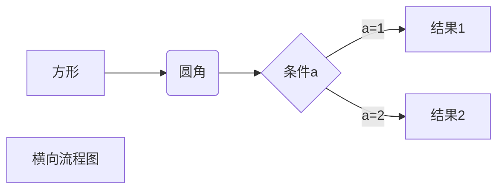
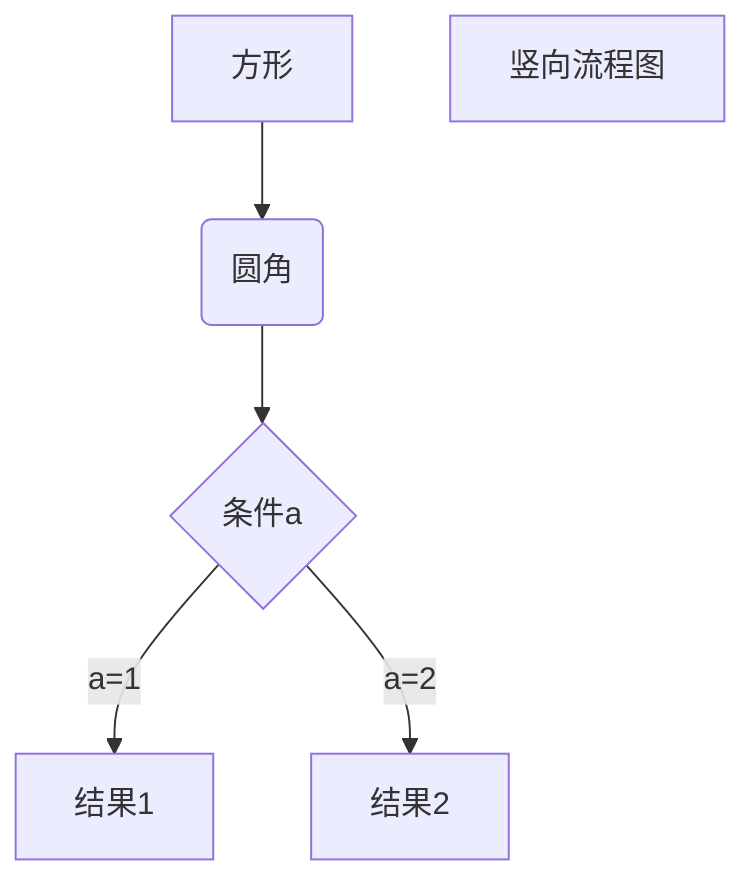

# markdown常用语法

\： 反斜杠为转义字符

## 1、标题

#号可以表示1-6级标题，个数对应几级标题

## 2、字体

斜体： *斜体1*  _斜体2_

粗体： **粗体1**  __粗体2__

粗斜体： ***粗斜体1***  ___粗斜体2___

加粗快捷键：ctrl+b

斜体快捷键：ctrl+i

## 3、换行

如果在编辑的时候，想让一行文字显示的时候换行，就在中间加 <br/>

## 4、区块引用

> 123
>
> > 123
> >
> > > 123

大于号 >进行区块引用，可以进行嵌套使用

## 5、链接

\[链接名称](链接地址)

\[我的博客](https://blog.xxxxxxx/xxxxxxxxxx)

[B站](https://www.bilibili.com/)

可以通过变量来设置一个链接，变量赋值在文档末尾进行

然后在文档的结尾为变量赋值（网址）

这个链接用 abc 作为网址变量 [ABC]\[abc]

[abc]: http://www.abc.com/

效果：这个链接用 abc 作为网址变量 [ABC](http://:www.abc.com/)

## 6、图片

!\[alt属性文本](图片地址)


## 7、列表

无序列表，使用 * 、+ 、- ，再加一个空格作为列表的标记

有序列表，使用数字并加上 . 号，再加一个空格作为列表的标记

* 无序列表 1
+ 无序列表 2
- 无序列表 3

1. 有序列表 1
2. 有序列表 2
3. 有序列表 3


通过添加tab可以实现列表的嵌套

+ 无序列表 1
+ 无序列表 2
	+ 无序列表 2.1
	+ 无序列表 2.2

1. 有序列表 1
	1.1 有序列表 1.1
2. 有序列表 2
	2.1 有序列表2.1

## 8、分割线

\---or\***

---

***

## 9、删除线

在要添加删除线的文字前后添加两个波浪线 `~~`

\~~这是删除的文字~~

~~这是删除的文字~~

## 10、下划线

在需要添加下划线的文字首尾添加 \<u>文本\</u>

<u>添加下划线</u>

## 11、代码块

\`a\`:用``来引用代码

`a`

代码区块（多行的）用```三个反引号指定语言写代码块

```python
print("HelloWorld")
```

## 12、表格

表格使用 | 来分割不同的单元格，【使用 - 来分割表头和其他行】必须要分割。

快捷键：ctrl+t

`:-` 将表头及单元格内容左对齐
`-:` 将表头及单元格内容右对齐
`:-:` 将表头及单元格内容居中

| 学号 | 班级 | 姓名 |
| :-: | :-: | :-: |
| 01   |    1 | 张三 |
| 02   |    2 | 李四 |
| 02   |    2 | 王五 |

## 13、注脚

可以通过\[^a]的方式在文本上加注脚，再通过\[^a]:来编写具体标注内容

markdown[^M]真是个好语法

[^M]:超详细的markdown语法

## 14、流程图

### 横向流程图

\```mermaid
graph LR
A[方形] -->B(圆角)
    B --> C{条件a}
    C -->|a=1| D[结果1]
    C -->|a=2| E[结果2]
    F[横向流程图]

\```



### 竖向流程图

\```mermaid
graph TD
A[方形] --> B(圆角)
    B --> C{条件a}
    C --> |a=1| D[结果1]
    C --> |a=2| E[结果2]
    F[竖向流程图]
\```



## 15、时序图

\```sequence
对象A->对象B: 对象B你好吗?（请求）
Note right of 对象B: 对象B的描述
Note left of 对象A: 对象A的描述(提示)
对象B-->对象A: 我很好(响应)
对象A->对象B: 你真的好吗？
\```

```sequence
对象A->对象B: 对象B你好吗?
Note right of 对象B: 对象B的描述
Note left of 对象A: 对象A的描述
对象B-->对象A: 我很好
对象A->对象B: 那就好
```

\```sequence
Title: 标题：复杂使用
对象A->对象B: 对象B你好吗?（请求）
Note right of 对象B: 对象B的描述
Note left of 对象A: 对象A的描述(提示)
对象B-->对象A: 我很好(响应)
对象B->小三: 你好吗
小三-->>对象A: 对象B找我了
对象A->对象B: 你真的好吗？
Note over 小三,对象B: 我们是朋友
participant C
Note right of C: 没人陪我玩
\```

```sequence
Title: 标题：复杂使用
A->B: B你好吗?
Note right of B: B描述
Note left of A: A描述
B-->A: 我很好
B->C: 你好吗
C-->>A: B找我了
A->B: 你真的好吗？
Note over C,B: 我们是朋友
participant D
Note right of D: 没人陪我玩
```
